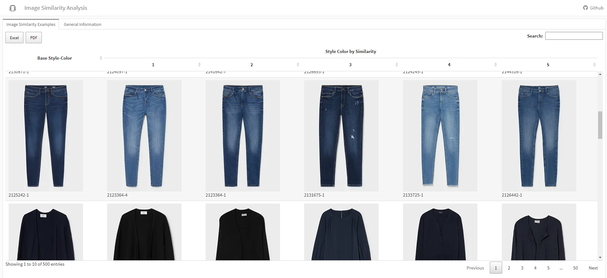
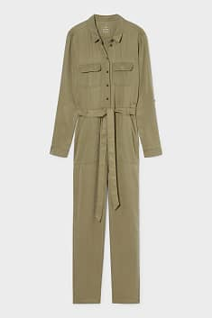
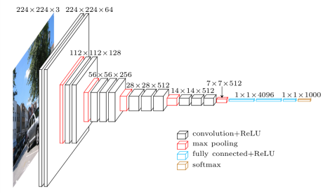

```{r, include = FALSE}
knitr::opts_chunk$set(
  collapse = TRUE,
  comment = "#>"
)
```


## Introduction
The .R module **Fashion Product Similarity Dashboard** is a simple workflow to show an introductory starting point to identify product similarities solely based on a product image. To see the full output, visit the following link:
[Fashion Product Similarity Dashboard](https://matbmeijer.github.io/fashion_product_similarity_dashboard/)


## Inputs
- Images are scraped from the fashion retailer [C&A](https://www.c-and-a.com/es/es/shop). The [robots.txt](https://www.c-and-a.com/robots.txt) file as been checked to ensure no infringements are done during scraping.

## Methodology

### Introduction

Image similarity is a subjective term, as it is difficult to determine similarity on which terms: quality, visual similarity, form, color? At the same time, the importance of each aspect might be different for every person.

The following methodology approaches this problem in simple terms: similarity is defined by the visual characteristics that help to determine the categorization of a product. In this case, it is limited to the frontal image of a fashion product.Here is an example:



An important point to note is that there is no **ground truth** for product similarity.

### Application

Taking into account that we define similarity by the characterstics that help to determine the categorization of a product, a neural network for product categorization might be helpful in some way.

This is exactly what will be used in this case:
The weights of the pretrained VGG16 model trained on the [Imagenet Dataset](https://www.image-net.org/) are used. As we are not interested in the classification of the product, but the dimensionality that determine the cassification, a global average pooling will be applied to the output of the last convolutional block to define a dimensional space for each fashion item.



The process has many advantages, as it requires no model training. In general terms it should be fairly robust, as the Imagenet dataset has a large amount of item variety. Yet some words of caution:

1. The process will only work if the images are homogenous among them (same perspective image, white background, no model/person, single fashion item per picture)
2. I would probably advice to train a propietary fashion item categorization neural network, and reuse the weights to define a dimensional space for each image that is especifically trained on fashion items.
3. This process does not work in the 'wild' - as for example Instagram images - fo rthe following reasons:
- Multiple products in same image requires image detection & image segmentation (identify if there are any fashion items in the image, and if so, segment them).

Last but not least, a distance matrix is calculated on the dimensional space of all items and the top 5 nearest neigbours identified (KD Tree Algorithm). In this case, no normalization is applied, but might be useful to test.

### Validation
As there is no ground truth of a level of similarity, the effectiveness of the process can only be evaluated visually.

## Outputs
- Image Similarity Dashboard

## Structure

### Executing the code

#### Word of caution
In no way is this code meant for a production-ready environment, instead it is build to show a relatively simple workflow to build an image similarity dashboard.

#### One-time Setup
To setup necessary libraries, the file *setup.R* should be run first before any other execution. This file will run all the necessary library installations. This needs to be done only once. The necessary libraries are all available at CRAN:

- [dplyr](https://cran.r-project.org/web/packages/dplyr/index.html)
- [stringr](https://cran.r-project.org/web/packages/stringr/index.html)
- [glue](https://cran.r-project.org/web/packages/glue/index.html)
- [tidyr](https://cran.r-project.org/web/packages/tidyr/index.html)
- [FNN](https://cran.r-project.org/web/packages/FNN/index.html)
- [DT](https://cran.r-project.org/web/packages/DT/index.html)
- [yaml](https://cran.r-project.org/web/packages/yaml/index.html)
- [loggit](https://cran.r-project.org/web/packages/loggit/index.html)
- [rvest](https://cran.r-project.org/web/packages/rvest/index.html)
- [binman](https://cran.r-project.org/web/packages/binman/index.html)
- [keras](https://cran.r-project.org/web/packages/keras/index.html)
- [rmarkdown](https://cran.r-project.org/web/packages/rmarkdown/index.html)
- [flexdashboard](https://cran.r-project.org/web/packages/flexdashboard/index.html)

#### Other Requirements

- Internet Access
- PANDOC installation for Rmarkdown
- Keras library installation with full dependencies
- R version >= 4.0
- On Windows a [Rtools installation](https://cran.r-project.org/bin/windows/Rtools/) is necessary (which happens normally by default when installing R)

#### Execution
The whole process can be initiated through the *main.R* code file, which will execute all *.R* files within the *./src* folder.


#### Important files
- **scripts.yaml**: This file is used to define the location of different executions, and should only be changed if development is needed.

### File management
- Raw input files are saved within the *./raw* folder
- Intermediate trasnformations are save within the *./silver* folder
- The output, the dashboard, is saved within the *./docs* folder

## Further information about Fashion & Convolutional Networks
[awesome-fashion-ai](https://github.com/ayushidalmia/awesome-fashion-ai)

## Questions
For any questions, you can contact me in [Github](https://github.com/matbmeijer).
