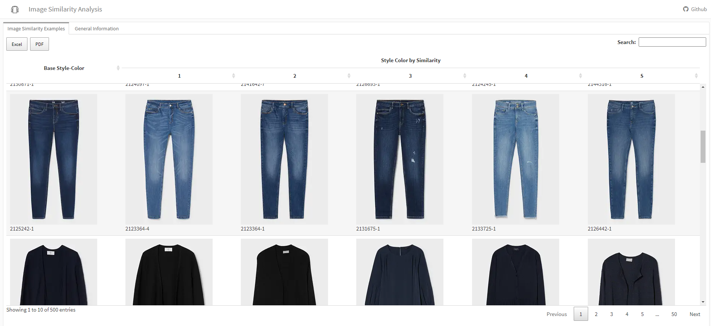
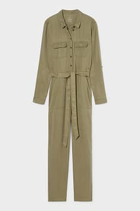

Fashion Product Similarity Dashboard
================

## Introduction

The .R module **Fashion Product Similarity Dashboard** is a simple
workflow to build a simple *dashboard* demonstrating how images can be
used to determine fashion item similarities based solely on a fashion
item product image. Only the image is used, no additional data is
included To see the resulting *dashboard*, visit the following link:
[Fashion Product Similarity
Dashboard](https://matbmeijer.github.io/fashion_product_similarity_dashboard/)

## Data input

-   Images are scraped from the fashion retailer
    [C&A](https://www.c-and-a.com/es/es/shop) with Selenium. The
    [robots.txt](https://www.c-and-a.com/robots.txt) file as been
    checked to ensure no infringements are carried out during scraping.

## Methodology

### Introduction

Image similarity is a subjective term, as it is difficult to determine
similarity in quantitative terms: What makes two fashion items similar?
Is it color, fitting, quality, form? Every indivual might value these
characterists’ importance differently.

The following methodology approaches this problem in a pragmatic manner:
fashion item similarity is defined by the visual characteristics that
help to determine the categorization of a fashion product. Yet, it is
important to note is that there is no **ground truth** for product
similarity. In this analysis, images are limited to using only the
frontal image of a fashion product to determine its similarity. Here is
an example:

### Application

Taking into account that we define similarity by the characterstics that
help to determine the categorization of a product, categorization
algorithms might be helpful to determine a dimensional space for the
fashion item images.

In the following case, the pretrained weights of the VGG16 neural
network model structure trained on the [Imagenet
Dataset](https://www.image-net.org/) are used. As we are not interested
in the classification of the product, but the dimensionality that
determine the cassification, a global average pooling will be applied to
the output of the last convolutional block to define a dimensional space
for each fashion item.

The process has many advantages, as it requires no model training. In
general terms it should be fairly robust, as the Imagenet dataset has a
large amount of item variety. Yet some words of caution:

1.  The process will only work if the images are homogenous among them
    (differences in images are solely based in changes of the product.
    In other words, the perspective of the image needs to be the same,
    the background needs to stay similar)
2.  I would probably advice to train a categorization neural network
    specifically for fashion products, and reuse the weights to define a
    dimensional space. Hereby it is ensured that the dimensional space
    is trully a reflection of clothing visual cues.
3.  This process does not work in the ‘wild’. Images from Instagram or
    magazines have much more heterogeneity, as they may display multiple
    products (fashion and non-fashion items) in the same image.
    Additionally, they might include a single or various models. The
    perspective on the product might vary a lot among all images and,
    lastly but not least, there might not be a single item focused.
    These cases deal with much more complex process, as they require
    fashion product detection & segmentation (identify if there are any
    fashion items in the image, and if so, segment them).

To obtain the end result, a distance matrix is calculated on the
calculated dimensional space and the top 5 nearest neigbours for each
fashion item are identified (KD Tree Algorithm). In this case, no
normalization is applied, but might be useful to test.

### Validation

As there is no ground truth of a level of similarity, the effectiveness
of the process can only be evaluated visually.

## Outputs

[Fashion Product Similarity
Dashboard](https://matbmeijer.github.io/fashion_product_similarity_dashboard/)

## Structure

### Executing the code

#### Word of caution

In no way is this code meant for a production-ready environment, instead
it is build to show a relatively simple workflow to build a product
similarity dashboard.

#### One-time Setup

To setup necessary libraries, the *setup.R* file should be run first
before any other execution. This file will run all the necessary library
installations. This needs to be done only once. The necessary libraries
are all available at CRAN:

-   [dplyr](https://cran.r-project.org/web/packages/dplyr/index.html)
-   [stringr](https://cran.r-project.org/web/packages/stringr/index.html)
-   [glue](https://cran.r-project.org/web/packages/glue/index.html)
-   [tidyr](https://cran.r-project.org/web/packages/tidyr/index.html)
-   [FNN](https://cran.r-project.org/web/packages/FNN/index.html)
-   [DT](https://cran.r-project.org/web/packages/DT/index.html)
-   [yaml](https://cran.r-project.org/web/packages/yaml/index.html)
-   [loggit](https://cran.r-project.org/web/packages/loggit/index.html)
-   [rvest](https://cran.r-project.org/web/packages/rvest/index.html)
-   [binman](https://cran.r-project.org/web/packages/binman/index.html)
-   [keras](https://cran.r-project.org/web/packages/keras/index.html)
-   [rmarkdown](https://cran.r-project.org/web/packages/rmarkdown/index.html)
-   [flexdashboard](https://cran.r-project.org/web/packages/flexdashboard/index.html)

#### Other Requirements

-   Internet access
-   PANDOC installation for Rmarkdown
-   Keras library installation with full dependencies
-   R version &gt;= 4.0
-   On Windows a [Rtools
    installation](https://cran.r-project.org/bin/windows/Rtools/) is
    necessary (which happens normally by default when installing R)

#### Execution

The whole process can be initiated through the *main.R* code file, which
will execute all *.R* files within the *./src* folder.

#### Important files

-   **scripts.yaml**: This file is used to define the location of
    different executions, and should only be changed if development is
    needed.

### File management

-   Raw input files are saved within the *./raw* folder
-   Intermediate trasnformations are save within the *./silver* folder
-   The output - the dashboard - is saved within the *./docs* folder

## Further information about Fashion & Convolutional Networks

[awesome-fashion-ai](https://github.com/ayushidalmia/awesome-fashion-ai)

## Questions

For any questions, you can contact me at
[Github](https://github.com/matbmeijer).
